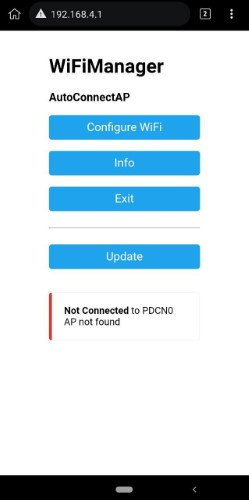
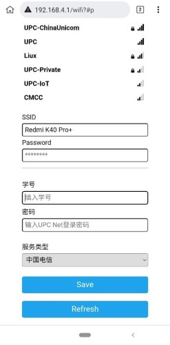

# UPCNet For Espressif

将`UPCNet` 移植到 `Espressif` 平台,以更便宜和简单的方式实现网络登录.

## Why This?
目前模拟`Web Portal`登录的方式大多数依赖高级语言环境或Linux 命令行工具,这个项目尝试使用ESP开发板来完成登录，不再依赖Openwrt或其他智能设备 ~~更加便宜~~
但是本项目的使用需要一定的计算机基础知识，如果你有智能路由器或宿舍内有一直开机的电脑，可能 [UPCNet](https://github.com/EndangeredF1sh/UPCNet)更加适合.

## 开始使用
### ⚙ 支持的设备
* ESP32 NodeMCU (ESP32 Devkit v1 测试通过)
* ESP8266 (未测试)
* ESP32C3 (理论上可用,需要等待工具链更新)
### 🧮 刷入与配置
* 使用PlatformIO Home中的`Open Project` 打开项目,连接开发板.
* 在`PIO侧栏`中根据开发板架构类型选取`esp32`/`esp8266`/`esp32c3`环境.你可以根据具体开发板型号修改`platformio.ini`文件中相应架构下的`borad`参数.具体值可在[Borads](https://docs.platformio.org/en/latest/boards/index.html#boards)中查找.
* 在`PIO侧栏`中的具体环境下选择`Upload and Monitor`,查看刷入是否成功.如果不成功,检查架构是否正确.
* 若刷入成功并启动,且Serial Monitor中可以看到如下信息:"Client Num:0".使用手机连接`AutoConnectAP`的WiFi热点(默认密码 12345678),并在`Serial Monitor`中查看是否能看到"Client Num:1".
* 手机应当提示网络认证并自动打开配置网页.如图:

* 进入`Configure WiFi`页面,选取WiFi或手动输入要连接的WiFi SSID,输入WiFi密码,并在第二部分输入你的网络登录信息,学号\密码\服务类型.点击`Save`提交.

* 连接成功后`AutoConnectAP`会消失,在`Serial Monitor`中可见`username is not empty`等字样,并输出IP信息.
* 开发板在正常运行时会间隔30s检测一次网络是否连通,若未连通则尝试登录.

## 使用的开源项目
* [UPCNet](https://github.com/EndangeredF1sh/UPCNet)
* [WiFiManager](https://github.com/tzapu/WiFiManager)
* [HTTPClient](https://github.com/espressif/arduino-esp32/tree/master/libraries/HTTPClient)
* [arduino-esp32](https://github.com/espressif/arduino-esp32)
